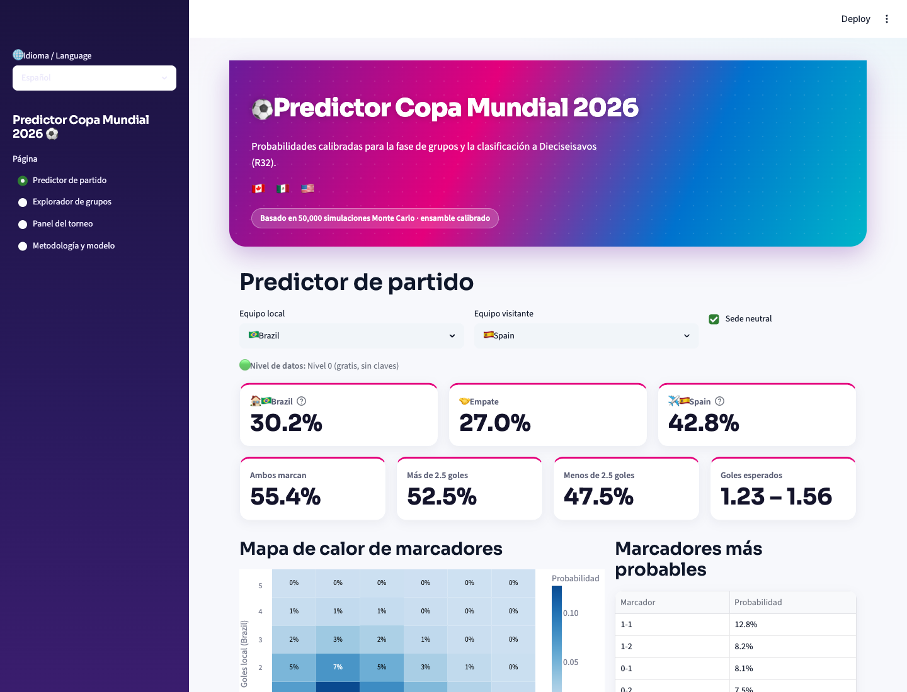
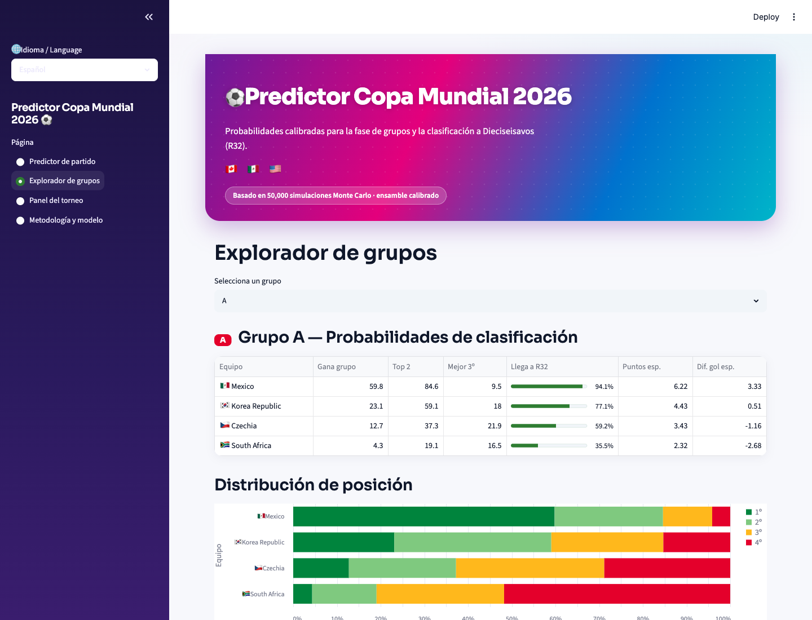
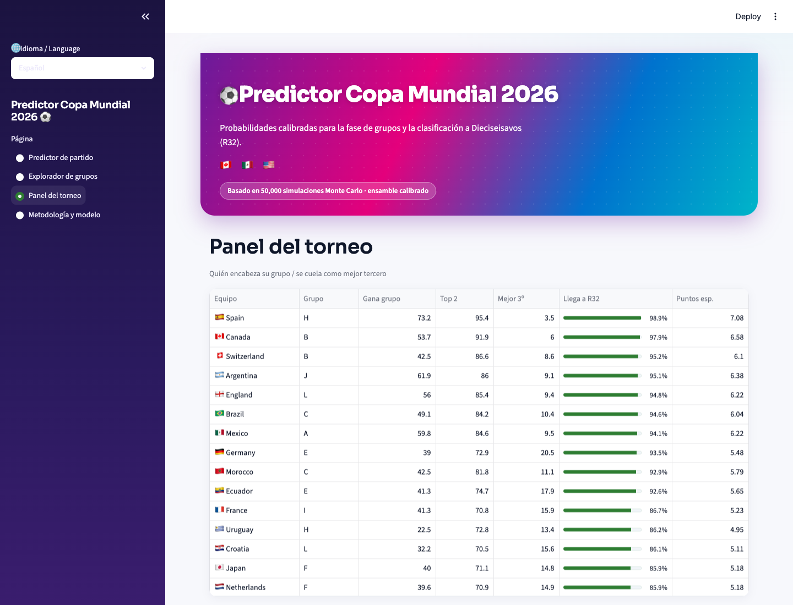

# Predictor Copa Mundial 2026 — Explicación completa

> Documento explicativo y didáctico de la aplicación: qué hace, de dónde saca su
> información, cómo funciona por dentro y cómo se mantiene al día. Escrito para que
> cualquier persona —sepa o no de estadística o fútbol— lo entienda, y lo bastante
> detallado como para servir de base a una presentación.

---

## 0. Resumen en una frase

**Un predictor probabilístico, calibrado y reproducible para la fase de grupos del Mundial
2026**: dice, con porcentajes honestos, qué tan probable es cada marcador, quién gana cada
grupo y qué selecciones llegan a Dieciseisavos de final (la ronda de 32 equipos, *R32*) — no
como una corazonada, sino a partir de más de 150 años de datos y decenas de miles de
simulaciones del torneo.

Es una herramienta **analítica y educativa, no de apuestas.** La incertidumbre del fútbol es
inevitable y la app la muestra en todo momento, con honestidad.

---

## 1. ¿Qué hace exactamente la app?

Tiene cuatro pantallas:

1. **Predictor de partido** — eliges dos selecciones y obtienes:
   - la *distribución completa de marcadores* (un mapa de calor: qué tan probable es 1–0,
     2–1, 0–0, etc.),
   - la probabilidad de **1X2** (gana local / empate / gana visitante),
   - **ambos marcan**, **más/menos 2.5 goles**, los resultados más probables y los goles
     esperados de cada equipo.
2. **Explorador de grupos** — por cada grupo: probabilidad de ganarlo, de quedar entre los
   dos primeros, de colarse como *mejor tercero*, de llegar a R32, la tabla esperada y la
   distribución de posición final (1º, 2º, 3º, 4º).
3. **Panel del torneo** — los 48 equipos, ordenables: quién encabeza su grupo y quién entra
   como mejor tercero.
4. **Metodología / ficha del modelo** — la explicación en lenguaje sencillo, las métricas de
   validación, la procedencia de los datos y las limitaciones.

Está en **español por defecto**, con interruptor a inglés. Y funciona **sin ninguna clave ni
costo**: con datos 100% gratuitos.

### Capturas de la aplicación

**Predictor de partido** — distribución de marcadores, 1X2 y mercados:



**Explorador de grupos** — probabilidades de clasificación y distribución de posición:



**Panel del torneo** — los 48 equipos ordenados por probabilidad de llegar a R32:



**Metodología y modelo** — procedencia de datos, reporte de validación y cuadro de R32:


---

## 2. ¿De dónde saca su información?

Todo nace de datos **abiertos y gratuitos**:

1. **Histórico de partidos internacionales 1872–presente** — un conjunto de datos público con
   **~49,000 partidos** de selecciones nacionales. Es la columna vertebral del modelo. Se da
   más peso a los partidos recientes mediante un "decaimiento temporal" (un partido de hace
   un año pesa más que uno de hace diez).
2. **Ratings Elo** — la app los **calcula ella misma** a partir de ese histórico, así que no
   depende de ninguna otra fuente.
3. **Calendario oficial verificado** — los **72 partidos** de la fase de grupos con fechas,
   sedes y altitud, los **12 grupos** confirmados y la estructura del cuadro de Dieciseisavos.
   Estos datos se verificaron contra fuentes oficiales del sorteo (diciembre de 2025).

Cada predicción muestra una **insignia del nivel de datos** que la alimentó, y la app
**registra la procedencia y la fecha** de cada dato que usa. Nada está inventado ni puesto
"a dedo".

---

## 3. El corazón del método: 50,000 simulaciones de Monte Carlo

### La idea en una frase
Es **jugar el Mundial completo 50,000 veces dentro de la computadora** y contar qué pasó,
para convertir esos conteos en probabilidades.

### La analogía de la moneda 🪙
Para saber qué probabilidad hay de que salga *cara*, podrías filosofar... o simplemente
**lanzar la moneda muchísimas veces y contar.** Si de 50,000 lanzamientos sale cara ~25,000
veces, concluyes: "la probabilidad de cara es ~50%".

Monte Carlo es exactamente eso, pero en vez de una moneda, lo que "lanzamos" es **un Mundial
entero.** (El nombre viene del casino de Mónaco: la idea es la misma que tirar los dados un
montón de veces para ver qué tan seguido sale cada número.)

### ¿Cómo se "juega" un Mundial simulado?
Una sola simulación es un Mundial imaginario de principio a fin:

1. **Cada partido se juega con "dados cargados".** No es una moneda justa: para *Brasil vs
   Haití* los dados están muy cargados a favor de Brasil; para *España vs Argentina* están
   casi parejos. El modelo decide qué tan cargados están (ver sección 5).
2. **Se saca un marcador al azar**, respetando esos dados. Una vez sale Brasil 2–0, otra vez
   Brasil 1–1, rara vez Haití 1–0. *No* usamos siempre el resultado más probable: dejamos que
   la sorpresa ocurra de vez en cuando, como en la vida real.
3. **Se juegan los 72 partidos así**, se arman las tablas de cada grupo, se aplican las reglas
   oficiales de desempate de la FIFA y se ve quién terminó 1º, 2º, 3º y quién clasificó.

Eso es **una** simulación: un Mundial completo, posible pero inventado.

### ¿Por qué 50,000 veces?
Porque **un solo Mundial no dice nada confiable.** En uno, quizás Haití da el campanazo y
elimina a Brasil. ¿Es Haití favorito? Claro que no: fue una de esas veces raras. Pero si
juegas **50,000 Mundiales** y cuentas:

> Brasil clasificó en ~47,300 de 50,000 → **94.6%**
> Haití clasificó en ~9,500 de 50,000 → **19%**

Ahora sí tienes probabilidades sólidas. La sorpresa ocurre en algunas simulaciones (y debe
ocurrir), pero **al promediar decenas de miles, las cifras se vuelven estables y honestas.**
Mientras más simulaciones, menos "ruido"; con 50,000 las cifras casi no cambian aunque
vuelvas a correrlo. La app las hace en **menos de un segundo.**

> 🧠 **La frase para recordar:** *No predecimos un futuro. Simulamos 50,000 futuros posibles
> y contamos en cuántos pasó cada cosa.* Es la misma técnica con la que los meteorólogos dicen
> "70% de probabilidad de lluvia".

---

## 4. El Elo: la "fuerza" de cada equipo 💪

### La idea
El **Elo es un número que resume qué tan fuerte es una selección.** Mientras más alto, mejor.
En la app, por ejemplo (aproximado): Argentina ≈ 2100 (de los más altos), México ≈ 1885,
Haití ≈ 1490 (de los más bajos).

### ¿De dónde sale?
De una regla muy justa, como el ranking de un videojuego en línea: **ganas puntos al ganar y
pierdes al perder, pero cuánto cambia depende de a quién enfrentaste.**

- 🟢 Equipo **fuerte le gana a uno débil** → gana *poquitos* puntos (se esperaba).
- 🔴 Equipo **débil le gana a uno fuerte** → ¡se lleva *muchos* puntos! (fue una hazaña).
- Ganar por **goleada** suma un poco más que ganar por la mínima.

La app toma los ~49,000 partidos históricos y los "revive" en orden, partido por partido,
sumando y restando puntos con esa regla. El número final de cada selección refleja **todo lo
que ha logrado contra todo tipo de rivales.**

> 🔑 **La clave:** el Elo no es opinión. Es una memoria matemática de quién le ha ganado a
> quién.

---

## 5. Cómo el modelo "carga los dados" de cada partido 🎲

### Paso 1 — De la fuerza a los goles esperados
El modelo compara los dos Elo y suma factores de contexto (ver sección 6) para estimar la
cifra clave: **¿cuántos goles se espera que meta cada equipo en promedio?**

> *Brasil vs Haití* → algo como **Brasil 2.1** goles esperados, **Haití 0.4** esperados.

### Paso 2 — De los goles esperados a la probabilidad de cada marcador
Aquí entra una herramienta estadística llamada **Dixon-Coles** (una variante del clásico
modelo de Poisson para fútbol). Responde: *"si en promedio esperas 2.1 goles, ¿qué tan
probable es meter exactamente 0, 1, 2, 3…?"*. Porque el fútbol es azaroso: un equipo que
"espera" 2.1 a veces mete 4 y a veces 0.

El modelo reparte la probabilidad entre **todos los marcadores posibles** y arma la **tabla
completa** (el mapa de calor de la app): la casilla *Brasil 2 – Haití 0* sale muy iluminada;
*Haití 3 – Brasil 0*, casi negra. *(Dixon-Coles además corrige finamente los marcadores
bajos como 0–0 y 1–1, que un modelo ingenuo calcula mal.)*

**Esos son los "dados cargados":** una tabla con la probabilidad de cada marcador. Cuando la
simulación "juega" el partido, saca un marcador de esa tabla — los probables salen seguido,
los raros casi nunca.

> 🔑 **La clave:** *Fuerza (Elo) + contexto → goles esperados → probabilidad de cada
> marcador.* Esa tabla es la que se "lanza" 50,000 veces.

---

## 6. El contexto: cancha, altitud y el factor anfitrión 🏟️

El modelo no mira solo la fuerza bruta. Ajusta cada partido por factores conocidos **antes
del pitazo inicial**:

- **Ventaja de local / anfitrión:** México, Estados Unidos y Canadá son sedes. Un anfitrión
  que juega en su país recibe un empujón... **incluso cuando figura como "visitante"**, porque
  el estadio y la afición siguen siendo suyos (por ejemplo, Canadá jugando en Vancouver).
- **Altitud:** la Ciudad de México está a ~2,240 m. Eso cansa más a los equipos no
  acostumbrados, así que el modelo reduce un poco su rendimiento ahí (y exime a las
  selecciones acostumbradas a la altura).
- **Descanso y viaje:** los días entre partidos de cada equipo, en un torneo repartido en
  tres países enormes, también cuentan.

Todo esto es **leakage-safe** (sin "hacer trampa"): solo usa información disponible antes del
partido, nunca el resultado que se quiere predecir.

---

## 7. Por qué "calibrado" lo es todo 🃏

### La idea
Un modelo **calibrado** es **honesto con sus porcentajes**: cuando dice *70%*, la cosa pasa
de verdad ~70% de las veces. Ni más confiado, ni menos.

### La prueba del clima ☔
Si revisas **todos los días que el meteorólogo dijo "70% de lluvia"** y llovió en ~7 de cada
10 → es confiable. Si solo llovió 3 de cada 10 → exagera. Igual aquí: juntamos todos los
partidos donde el modelo dijo "local gana 70%" y verificamos cuántos ganó el local de verdad.
Si es ~70% → **calibrado** ✅.

### Por qué importa
Un modelo puede *acertar el ganador* y aun así mentir en los números. Uno que grita "¡Brasil
gana 95%!" cuando en realidad era 70% acertó... pero el 95% era exagerado y peligroso (te
haría confiarte). **Preferimos un modelo modesto y honesto antes que uno espectacular y
exagerado.** Por eso aplicamos un paso final de "ajuste de honestidad" (calibración) y
**medimos** qué tan bien quedó. En las pruebas, cuando dice 70%, pasa cerca del 70%.

---

## 8. Cómo se eligen los "mejores terceros" 🥉

### El problema
Hay **12 grupos de 4 equipos.** De cada grupo, el **1º y el 2º** pasan directo a Dieciseisavos
(24 equipos). Pero esa ronda necesita **32**... faltan 8. Salen de los terceros lugares: hay
12 terceros, pero solo **los 8 mejores** se salvan; los otros 4 quedan eliminados.

### ¿Cómo se decide cuáles 8?
Se hace una tabla aparte **solo con los 12 terceros** y se ordenan, de mejor a peor:

1. **Más puntos** 🥇
2. Si empatan → **mejor diferencia de goles**
3. Si siguen → **más goles a favor**
4. Y si aún empatan → juego limpio / ranking FIFA como último recurso

Los **8 de arriba pasan**; los **4 de abajo, a casa.** Esto vuelve emocionante el último
partido: un tercero con 4 puntos puede clasificar y otro con los mismos 4 puntos puede quedar
fuera **por un solo gol de diferencia.** La app muestra una columna **"Mejor 3º"** con esa
probabilidad para cada equipo.

### Un detalle importante de exactitud (regla 2026)
Para 2026, la FIFA **cambió el orden de desempate** dentro de un grupo: ahora, cuando dos
equipos quedan iguales en puntos, **primero se mira el resultado entre ellos** (el "mano a
mano") y **después** la diferencia de goles general. Es el primer cambio de esta regla desde
1970, y la app lo implementa correctamente.

---

## 9. Por qué hay dos modelos (y un árbitro entre ellos) 🤖

"Dos cabezas piensan mejor que una." En vez de confiar en un solo método, la app usa **dos
formas distintas de predecir** y las combina:

- **Modelo 1 — el estadístico (Dixon-Coles):** el de las secciones 4–5. Parte de la fuerza
  (Elo) y reparte probabilidades de goles con una fórmula clásica del fútbol. Sólido y
  transparente.
- **Modelo 2 — el de inteligencia artificial (LightGBM):** este **no usa una fórmula fija**;
  *aprende patrones solo* mirando miles de partidos pasados. Le mostramos pistas conocidas
  antes del pitazo (fuerza, **forma reciente**, **días de descanso**, si la cancha es
  neutral…) y el resultado real. Tras miles de ejemplos, aprende reglas sutiles como *"equipos
  en gran forma y bien descansados marcan un poco más"*, que una fórmula rígida no captura.

### Cómo se combinan
No elegimos favorito a dedo. Probamos ambos contra **partidos reales que ninguno había visto**
y medimos cuál acertó más. Según eso, el sistema decidió mezclarlos así:

> **≈ 65% el modelo estadístico + ≈ 35% el de IA.**

La predicción final es ese **promedio inteligente**. Si uno se equivoca en un caso, el otro
ayuda a corregir. Resultado: una predicción **más estable y robusta** que la de cualquiera por
separado.

---

## 10. ¿Funciona? La validación honesta 📊

No basta con que el modelo *suene* bien; hay que **probarlo contra el pasado**, prediciendo
partidos viejos usando solo la información disponible *antes* de cada uno (sin hacer trampa).

Se compara contra una base sencilla pero fuerte: **predecir solo con el Elo.** La métrica
principal es el **RPS** (mide qué tan cerca estuvo la probabilidad del resultado real; **más
bajo = mejor**).

| Modelo | RPS (más bajo es mejor) | Calibración (ECE, más bajo es mejor) |
|---|---|---|
| Solo Elo (base a vencer) | 0.1789 | 0.051 |
| Modelo estadístico (Dixon-Coles) | 0.1748 | 0.028 |
| **Ensamble calibrado (los dos juntos)** | **0.1747** | 0.034 |

**Lectura honesta:** el modelo **supera a la base de solo-Elo** y queda **bien calibrado**
(la calibración reduce el error a casi la mitad respecto a la base). En el 1X2, el ensamble y
el modelo estadístico quedan parejos; la ventaja del segundo modelo se nota más en mercados de
marcador (ambos marcan, más/menos goles, marcador exacto). Todo esto queda documentado en un
reporte automático (`MODEL_REPORT.md`), con su curva de calibración.

---

## 11. El cuadro completo (cómo encaja todo) 🧩

```
49,000 partidos históricos (gratis, abiertos)
   │
   ├─► Elo (fuerza de cada equipo) ───────┐
   ├─► Forma reciente, descanso ──────────┤
   ├─► Contexto: local, altitud, viaje ───┤
   │                                       ▼
   │        ┌── Modelo 1: estadístico (Dixon-Coles) ──┐
   │        └── Modelo 2: IA (LightGBM) ──────────────┤
   │                                                  ▼
   │              Mezcla (~65/35) + ajuste de honestidad (calibración)
   │                                                  ▼
   │                Probabilidad de cada marcador, partido por partido
   │                                                  ▼
   │                  Se "lanza" 50,000 veces  (Monte Carlo)
   │                                                  ▼
   └─►  Tablas de grupo + reglas de desempate FIFA 2026 + mejores 8 terceros
                                                      ▼
        "Brasil clasifica 94.6% · México gana su grupo 60% · este 3º entra 41%…"
```

---

## 12. ¿Cómo se mantiene al día con los resultados del torneo?

A medida que se juegan partidos del Mundial, **un solo comando reconstruye todo** con la
información más fresca:

```
python -m wc2026.pipeline --refresh
```

Esto: ① vuelve a descargar el histórico (que incluye los partidos ya jugados, porque el
conjunto de datos abierto se actualiza casi a diario), ② recalcula el Elo y la forma de cada
selección, ③ re-entrena los modelos, ④ vuelve a simular el torneo y ⑤ guarda todo. Tarda
~30 segundos y es **determinista** (mismo resultado dada una semilla).

Conforme avanza la fase de grupos, las probabilidades **se afinan solas**: las simulaciones ya
**fijan los partidos disputados** y solo proyectan los pendientes, así que tras cada jornada
las cifras de "quién clasifica" se vuelven más precisas. Y puede **automatizarse** (por
ejemplo, programar el refresco cada mañana durante el torneo) para que la app siempre muestre
el panorama del día sin intervención manual.

---

## 13. Por qué se puede confiar (y dónde no exagerar)

**Fortalezas:**
- **Reproducible:** un solo comando reconstruye todo; mismos resultados dada una semilla.
- **Sin trampas (sin fuga de datos):** cada predicción usa solo información previa al partido,
  verificado con pruebas automáticas.
- **Honesto:** probabilidades calibradas y validadas; supera a la base de solo-Elo.
- **Transparente:** registra la fuente y la fecha de cada dato; muestra el nivel de datos.
- **Gratis y autónomo:** funciona sin claves ni costos.

**Limitaciones (declaradas abiertamente):**
- La **incertidumbre del fútbol es irreducible**: un 60% no es una certeza.
- Es **más débil con selecciones de pocos datos recientes** (debutantes o equipos con pocos
  partidos comparables).
- **No** incluye alineaciones ni lesiones del día (eso requeriría fuentes de pago opcionales).
- Las horas exactas de cada partido no se usan (solo fecha y sede), y el detalle final de
  contra quién juega cada tercero en Dieciseisavos depende de una tabla oficial muy extensa de
  la FIFA que no afecta a *quién clasifica*.
- **Es una herramienta analítica y educativa, no asesoría de apuestas.**

---

## 14. Glosario rápido

- **Probabilidad calibrada:** cuando el modelo dice 70%, ocurre ~70% de las veces.
- **Elo:** número que mide la fuerza de un equipo según su historial.
- **Goles esperados:** cuántos goles, en promedio, se espera que marque un equipo en ese
  partido.
- **Dixon-Coles / Poisson:** la fórmula estadística que convierte goles esperados en la
  probabilidad de cada marcador.
- **LightGBM:** el modelo de inteligencia artificial que *aprende* patrones de miles de
  partidos.
- **Ensamble:** combinar dos modelos en una sola predicción más robusta.
- **Monte Carlo:** simular el torneo miles de veces para estimar probabilidades.
- **RPS:** métrica que mide qué tan buenas son las probabilidades (más bajo = mejor).
- **R32 / Dieciseisavos:** la ronda de 32 equipos, primera fase eliminatoria.
- **Mejor tercero:** uno de los 8 terceros lugares (de 12) que avanzan a R32.

---

*Documento generado para el proyecto wc2026-predictor. Herramienta analítica y educativa; la
incertidumbre es inevitable; no es asesoría de apuestas.*
